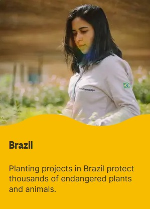
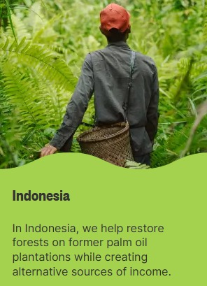
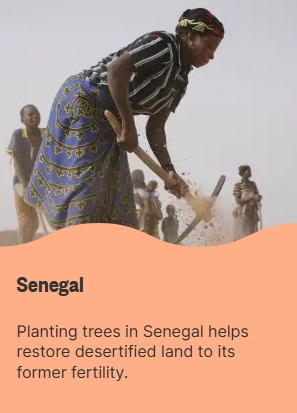

<!doctype html>
<html>
<head>
    <meta charset="UTF-8">
    <meta name="viewport" content="width=device-width, initial-scale=1.0">
    <title>EcoMinded</title>

    <link rel="preconnect" href="https://fonts.googleapis.com">
    <link rel="preconnect" href="https://fonts.gstatic.com" crossorigin>
    <link href="https://fonts.googleapis.com/css2?family=Open+Sans&display=swap" rel="stylesheet">
         
    <html lang="en">

    <link rel="stylesheet" href="style.css">
</head>

<body>
    <h2 class="logo">EcoMinded</h2>
    

        

            

            

            

                <ul>
                    <li><a href="#">HOME</a></li>
                    <pre><li><a href="#">SERVICE</a></li></pre>
                    <li><a href="#">ABOUT</a></li>
                    <pre><li><a href="#">PLANT TREES</a></li></pre>
                </ul>
            

<!--
            

                <input class="srch" type="search" name="" placeholder="Type To text">
                <a href="#"> <button class="btn">Search</button></a>
            

-->

        
 
        

            <h1>Start Your Journey Towards a  Greener  Future</h1>
            
Welcome to EcoLife, your one-stop destination for embracing an eco-friendly lifestyle that will help
                   protect our planet and secure a sustainable future in a world where environmental
                  issues are at the forefront of global concern

                <button class="cn"><a href="#">JOIN US</a></button>

           <!---    

                    <h2>Login Here</h2>
                    <input type="email" name="email" placeholder="Enter Email Here">
                    <input type="password" name="" placeholder="Enter Password Here">
                    <button class="btnn"><a href="#">Login</a></button>

                    
Don't have an account 
                    <a href="#">Sign up </a> here</a>

                    
Log in with

                    

                        <a href="#"><ion-icon name="logo-facebook"></ion-icon></a>
                        <a href="#"><ion-icon name="logo-instagram"></ion-icon></a>
                        <a href="#"><ion-icon name="logo-twitter"></ion-icon></a>
                        <a href="#"><ion-icon name="logo-google"></ion-icon></a>
                        <a href="#"><ion-icon name="logo-skype"></ion-icon></a>
                    
  ---->

                

                    

                

        

    

    

    <section class="course">
    <h1>Services We Offer</h1>
    

    
    

      <h3>Green Consulting</h3>
      <p1>Offer consulting services to help individuals and businesses make sustainable choices in various aspects of their lives, such as energy use, transportation, and waste reduction</p1>
    

    

      <h3>Energy Audits</h3>
      <p1>Conduct home or business energy audits to identify areas where energy efficiency can be improved. Suggest eco-friendly appliances, lighting, and renewable energy sources</p1>
    

    

      <h3>Zero-Waste Workshops</h3>
      <p1>Organize workshops and courses on how to reduce waste, recycle, compost, and make sustainable choices in daily life</p1>
    

    

      <h3>Eco-Friendly Cleaning Services </h3>
      <p1>Offer cleaning services that use non-toxic and eco-friendly cleaning products. Provide guidance on eco-friendly cleaning practices to your clients</p1>
    

    

      <h3>Organic and Local Food Services</h3>
      <p1> Connect consumers with local and organic food sources, such as farmer's markets, CSAs (Community Supported Agriculture), and meal delivery services</p1>
    

    

      <h3>Eco-Friendly Pet Services</h3>
      <p1>Provide pet care services that prioritize sustainability, such as eco-friendly pet products and practices</p1>
    

    

    </section>

    <section class="Campaigns">
        <h1>Our Campaigns</h1>
        <h2>We Plant in 35+ Countries with Local Organizations</h2>

    

    
    

     
     

     

    

    

     
    

    

     
    

    

    </section>

     <section class="Team">
     

     <h1>Our Team</h1>
     

       

        

          
          <h3>Samantha Rogers</h3>
          <h2>Founder / CEO</h2>
          

        

        

         

          
          <h3>Robin Brown</h3>
          <h2>Founder / CEO</h2>
          

        

     

     

    </section>

    <section class="footer">
        <h4>About Us</h4>
            
We are passionate advocates of an eco-friendly and sustainable lifestyle. Our mission is to inspire and empower individuals 
                to make choices that benefit not only themselves but also planet we call home

        

                  <a href="#"><ion-icon name="logo-facebook"></ion-icon></a>
                  <a href="#"><ion-icon name="logo-skype"></ion-icon></a>
                  <a href="#"><ion-icon name="logo-instagram"></ion-icon></a>
                  <a href="#"><ion-icon name="logo-twitter"></ion-icon></a>
                  <a href="#"><ion-icon name="logo-google"></ion-icon></a>
                  <a href="#"><ion-icon name="logo-skype"></ion-icon></a>
                        
        

        
        

            

                

                    
<a href="#">Terms & Conditions</a>

                

                

                    
<a href="#">Privacy Policy</a>

                

                

                    
<a href="#">Resources</a>

                

            

            

            

                
&copy; Oct 2023 | EcoMind Inc
                

            

        

        
    </section>

   
</body>
</html>
